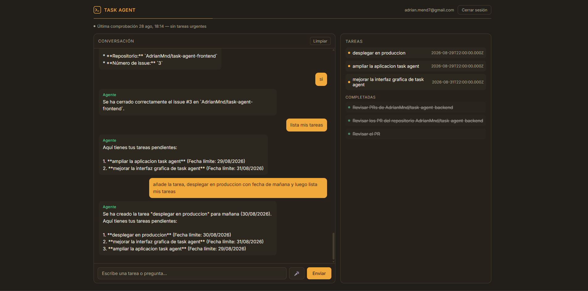

# Task Agent — Frontend

Interfaz de chat en React para hablar con el agente de tareas. Diseño propio ("consola de
control": fondo oscuro, acentos de color con significado, tipografía técnica), responsive
con vista de pestañas en móvil.

Repo hermano: [task-agent-backend](https://github.com/AdrianMnd/task-agent-backend)

**Demo en vivo**: https://taskagent-adrianmnd.vercel.app



## Stack

- **React 18 + TypeScript + Vite**
- Sin librería de gestión de estado externa (Redux, Zustand...) — `useState`/`useEffect`
  es suficiente para el tamaño de esta app, deliberadamente para no añadir complejidad
  innecesaria.
- Sin router — la única "navegación" es login vs. app autenticada, resuelta con un
  condicional en `App.tsx`.
- **MediaRecorder + Web Audio API** (nativas del navegador) para mensajes de voz —
  ver más abajo por qué no se usó `SpeechRecognition`.

## Estructura

```
src/
  App.tsx                    — shell: cabecera, barra de estado, pestañas móvil, layout
  auth.ts                    — almacenamiento de token/usuario en localStorage
  styles.css                 — sistema de diseño completo (tokens + componentes)
  api/client.ts               — todas las llamadas HTTP al backend
  components/
    LoginForm.tsx            — login, registro y solicitud de reset de contraseña
    ChatWindow.tsx           — estado de la conversación, streaming, auto-scroll, limpiar
    MessageBubble.tsx        — burbuja de mensaje individual
    MessageInput.tsx         — input de texto + grabación de voz
    TaskPanel.tsx            — lista de tareas con indicadores de estado por color
    ReminderStatus.tsx       — píldora de estado del último recordatorio automático
```

## Sistema de diseño

Todo el look vive en `styles.css` como variables CSS en `:root`, no hay CSS-in-JS ni
librería de componentes:

- **Color con significado**, no decorativo: ámbar (`--amber`) = pendiente/acción del
  agente, verde (`--green`) = completado/éxito, rojo (`--red`) = vencido/irreversible.
- **Tipografía única (Inter)** en toda la app. Los elementos que llevan tratamiento visual
  de "consola" (cabecera, fechas, etiquetas) usan mayúsculas + `letter-spacing` en vez de
  una fuente monospace distinta — más legible sin perder la identidad.
- **Barra de estado** (`.status-strip`) bajo la cabecera: se enciende y pulsa en ámbar
  mientras el agente está pensando o ejecutando una herramienta (prop `onActiveChange` que
  `ChatWindow` reporta a `App`). Es el elemento "firma" del diseño — conectado
  funcionalmente al bucle del agente, no solo decorativo.
- **Layout fluido**: `max-width: 2000px` con padding lateral en `clamp()` para aprovechar
  pantallas anchas sin perder legibilidad; las burbujas de chat limitan su ancho en
  píxeles (`min(75%, 640px)`) independientemente de lo ancho que sea el panel.
- **Responsive por pestañas**: por debajo de 860px, chat y tareas dejan de estar
  lado a lado y pasan a pestañas (`Chat` / `Tareas`) controladas por estado en `App.tsx`,
  no por CSS puro — solo se renderiza una a la vez.

## Autenticación

- Token JWT y datos del usuario (`{id, email}`) en `localStorage` (código real desplegado,
  a diferencia de un artifact de Claude, así que `localStorage` funciona con normalidad).
- `api/client.ts` añade el header `Authorization: Bearer <token>` a toda petición
  autenticada. Un 401 limpia la sesión y recarga la página — **excepto** en login/registro,
  donde un 401 significa "credenciales incorrectas", no "sesión caducada" (bug real que se
  corrigió: al principio cualquier 401 disparaba la recarga silenciosa, incluido un fallo
  de login, así que el usuario nunca veía el mensaje de error).

## Chat en streaming

`sendMessage` en `api/client.ts` no espera una respuesta JSON completa: lee el `body` de
la respuesta como stream (`response.body.getReader()`) y va invocando un callback por cada
trozo de texto que llega. `ChatWindow` añade un mensaje de asistente vacío al enviar, y lo
va rellenando en vivo con cada trozo — de ahí que el texto aparezca palabra a palabra en
vez de aparecer todo de golpe al final.

## Mensajes de voz

La primera versión usaba la `SpeechRecognition` nativa del navegador, pero **Brave la
bloquea por diseño** (privacidad: esa API depende de un servicio de Google). La solución
fue grabar el audio con `MediaRecorder` (estándar, funciona igual en cualquier navegador) y
mandarlo al backend, que lo transcribe con Gemini — mismo proveedor de IA que ya usa el
agente, sin depender de ningún servicio propietario del navegador. Además, `AnalyserNode`
(Web Audio API) mide el volumen en tiempo real para detectar cuándo el usuario deja de
hablar y parar la grabación sola, sin tener que pulsar el botón dos veces.

## Variables de entorno

| Variable | Uso |
|---|---|
| `VITE_API_URL` | URL base de la API del backend (incluye `/api`) |

## Puesta en marcha local

```bash
npm install
cp .env.example .env   # apunta a localhost:3001/api por defecto
npm run dev
```

Necesita el backend corriendo en paralelo.

## Testing

**Unitarios (Vitest + Testing Library):**

```bash
npm test
```

65 tests: `auth.ts`, `api/client.ts` completo (incluyendo el streaming, mockeando
`fetch` y el `ReadableStream`), y los 8 componentes. Entorno `jsdom` — nota honesta: como
`jsdom` no implementa `navigator.mediaDevices`, el test de `MessageInput` verifica el
comportamiento real de un navegador sin soporte (el botón de micro no aparece), pero no
puede ejercitar la rama en la que sí existe soporte de grabación.

**End-to-end (Playwright):**

```bash
npx playwright install chromium   # una vez, la primera vez
npm run test:e2e
```

10 tests en 4 archivos (`auth`, `chat`, `tasks`, `responsive`) que arrancan la app de
verdad en un navegador, pero interceptan todas las llamadas de red con `page.route()` —
no necesitan el backend real ni una base de datos. Cubren login/registro/reset de
contraseña, envío de mensajes, visualización de tareas, y el cambio a pestañas en móvil.

⚠️ Estos e2e se escribieron y se verificó que Playwright los reconoce sin errores
(`npx playwright test --list`), pero no se ejecutaron contra un navegador real durante el
desarrollo — el entorno donde se generaron no tenía acceso al CDN de descarga de
Chromium. Ejecuta `npm run test:e2e` tú la primera vez para confirmar que pasan.

## Despliegue

Vercel, auto-deploy en `master`. Vite detecta el framework automáticamente.

## Limitaciones conocidas

- Sin tests automatizados todavía (pendiente, próxima iteración del proyecto).
- El límite de Resend (ver README del backend) afecta a los recordatorios y al reset de
  contraseña, no al resto de la funcionalidad del frontend.
